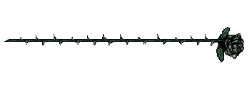

  <div align="center">

  

  <a href="https://github.com/faiqhzf">
    
  </a>

  <br/>

  
  [](https://www.linkedin.com/in/faiqhudzaifah/)
  [](mailto:faiqhudzaifah98@gmail.com)
  [](https://github.com/faiqhzf)

  </div>

  ## 👾 About Me

```python
class Faiq:
    def __init__(self):
        self.role = "Informatics Engineering Student @ STMIK Mardira Indonesia"
        self.based_in = "Bandung, West Java, Indonesia 🇮🇩"
        self.enjoys = [
            "building software",
            "training models",
            "drawing",
            "writing",
            "making videos"
        ]

    def currently(self):
        return [
            "Learning Deep Learning",
            "Building portfolio projects",
            "Trying to become better than yesterday"
        ]

    def fun_fact(self):
        return "I probably overthink both code and life."

me = Faiq()
```

  <div align="center">
 <a href="https://github.com/faiqhzf">
  
</a>

 

  </div>

  ## 🛠️ Tech Stack

  <div align="center">

  **Programming & Frameworks**
  <br/>
  

  **Tools & Infra**
  <br/>
  

  **Data Science / ML**
  <br/>
  
  
  
  

  **Design & Multimedia**
  <br/>
  
  
  

  
  </div>


  ## 🏆 Certifications & Training

  <details open>
  <summary><b>📁 Government Programs (4)</b></summary>

  <details open>
  <summary>📂 Digital Talent Scholarship — Komdigi</summary>

  - 📄 [Pengenalan Data Science dan Pemanfaatannya di Berbagai Sektor](certificates/Sertifikat_MUHAMMAD%20FAIQ%20HUDZAIFAH_Pengenalan%20Data%20Science%20dan%20Pemanfaatannya%20di%20Berbagai%20Sektor.pdf)
  - 📄 [Associate Data Scientist + Python](certificates/Sertifikat_MUHAMMAD%20FAIQ%20HUDZAIFAH_Associate%20Data%20Scientist%20+%20Python%20-%20Nasional.pdf)
  - 📄 [Data Scientist Supervisor](certificates/Sertifikat_MUHAMMAD%20FAIQ%20HUDZAIFAH_Data%20Scientist%20Supervisor%20-%20Nasional.pdf)
  - 📄 [Fundamental of Deep Learning](certificates/Sertifikat_MUHAMMAD%20FAIQ%20HUDZAIFAH_Fundamental%20of%20Deep%20Learning%20-%20Nasional.pdf)
  </details>

  </details>

  <details>
  <summary><b>📁 Private Institutions (2)</b></summary>

  - 📄 [National AI Training for Daily Work Productivity](certificates/national-ai-training.pdf)
  - 📄 [The AI Sustainability Paradox: Balancing Innovation with Environmental Impact](certificates/ai-sustainability-paradox.pdf)

  </details>

  <details>
  <summary><b>📁 Academic Institutions (1)</b></summary>

  - 📄 [10th International Conference on Business, Economy, Management and Social Studies (10th BEMSS)](certificates/10th-bemss.pdf) — STMIK Mardira Indonesia × Research Synergy

  </details>
  <div align="center">
 
  </div>


  ## 🚀 Projects & Portfolio

  <table>
  <tr>
  <td width="50%" valign="top">

  ### 🎮 Tracking Project
  *Full-Stack Developer · 2025*

  Gamified productivity platform RPG-style leveling, activity heatmap, focus timer, admin dashboard, public-facing pages.

  `Elysia.js` `Bun` `PostgreSQL` `Drizzle ORM` `React 18` `Astro v5`

  [](https://github.com/faiqhzf/tracking-project)
  [](#)
  [](#)

  </td>
  <td width="50%" valign="top">

  ### 🕵️ Otentik
  *AI/ML Engineer · 2026*

  Lightweight CNN (608K params) trained from scratch + transfer learning to detect real vs. AI-generated face images. Fully client-side inference, no backend.

  `TensorFlow.js` `CNN` `Computer Vision`

  [](https://github.com/faiqhzf/otentik)
  [](#)

  </td>
  </tr>
  <tr>
  <td width="50%" valign="top">

  ### 🧾 Employee Management System
  *Backend Developer · 2026*

  REST API (17 endpoints) with role-based auth (HR/Employee), JWT, BCrypt encryption, layered controller-service-repository architecture.

  `Spring Boot` `Spring Security` `Spring Data JPA`

  [](https://github.com/faiqhzf/manajemen-karyawan)

  </td>
  <td width="50%" valign="top">

  ### 🏫 SMA Pasundan Majalaya — Official Website
  *Full-Stack Developer · 2025–2026*

  Rebuilt school website with admin CMS (news, agenda, profile management) + authentication. Live and actively used by the school.

  `Next.js` `Admin CMS` `Auth`

  [](https://github.com/faiqhudzaifah/smapasundanmajalaya)

  </td>
  </tr>
  </table>


  <div align="center">
  
  </div>

## 🌙 Beyond Code

Things I enjoy when I'm away from the terminal.

**✍️ Writing**
I occasionally write short stories and random thoughts.

**🎨 Visual Art**
Mostly digital illustration, Photoshop experiments, and cover artworks.

**🎬 Content**
Creating videos, editing, and sharing things I learn.

**📚 Books & Ideas**
Existentialism, psychology, philosophy, and literature — writers I keep coming back to include Camus, Dostoevsky, Kafka, Nietzsche, Stirner, and Cioran. They don't define what I believe, but they often shape the questions I ask while building things.

   <div align="center">
  
  </div>

  ## 📈 GitHub Stats

  <div align="center">
  
  

  

  
  </div>

  

  <div align="center">
  <i>"Existence precedes essence — build the thing before you decide what it means."</i>
  </div>

 <div align="center">
  
</div>
